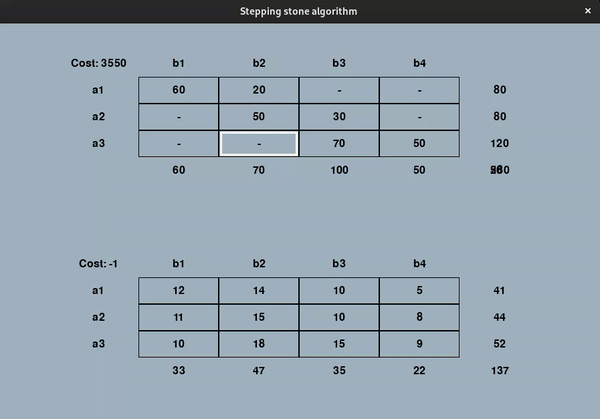

# Stepping Stone Algorithm

[](https://www.python.org/)
[](./LICENSE.md)
[](https://forthebadge.com)


This project visualizes the stepping stone algorithm to determine the most cost-effective path for distributing products based on a quantity and cost tables. The algorithm optimizes the distribution process by iteratively evaluating possible paths and adjusting the quantities to minimize costs.

<br/>
<br/>

<p align="center">
  
</p>

## Getting Started

To run the project, ensure you have Python installed on your system. Additionally, you need to have Pygame installed.

### Installation

1. Clone the repository:

    ```bash
    git clone https://github.com/sm-alejandr0/stepping_stone_algorithm
    ```

2. Install Pygame:

    ```bash
    pip install -r requirements.txt
    ```

## Usage

1. Run the `main.py` file to launch the application.
2. The interface will display two tables: one for quantities and one for costs.
   (you can edit these values in `constants.py`)
3. Left-click on a cell in the quantities table to edit its value.

#### Auto

4. Press <kbd>a</kbd> to start the algorithm. It will calculate every possible path and the associated costs. Then it will update the table using the cheapest path until the minimum costs are reached.

#### Manual

4. Right-click on a cell in the quantities table to mark it as the starting point for calculation. The algorithm will find the possible paths from this cell.
5. The cost will be displayed in the console. If the costs are negative, the current path is cheaper.
6. Press <kbd>u</kbd> to update the table. The new cost will be displayed on the console.

## Algorithm Details

The stepping stone algorithm works by iteratively evaluating possible paths through the quantity table while considering the associated costs. It identifies the most cost-effective path by exploring all potential routes and adjusting quantities to minimize costs.

## Contributing

Contributions are welcome! Feel free to submit bug reports, feature requests, or pull requests to help improve the project.

## License

This project is licensed under the MIT License.

## Acknowledgments

The stepping stone algorithm was invented by Abraham Charnes and William W. Cooper.
